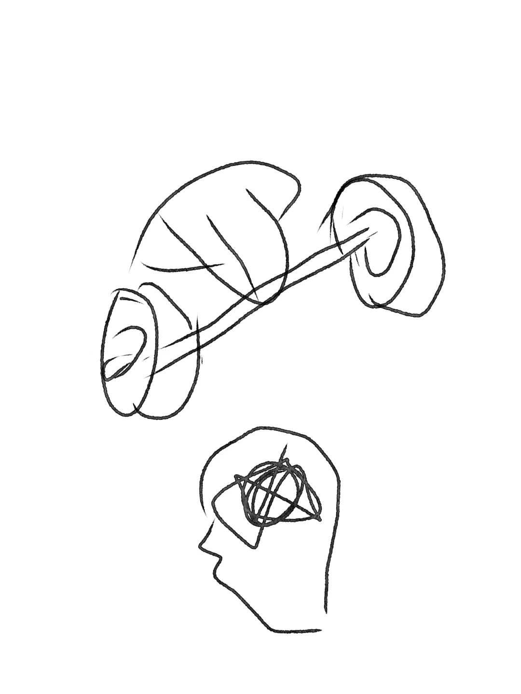

|type | instance |meaning|
|:---|:---|:---|
|\<place_pronoun\> |ここ|to designate a place|
| \<object_pronoun\> | これ | to designate an object |
| \<person_pronoun\> | 私 | to designate a person |
| \<pronoun_adjective\> | この|to specify an object by designation |
| \<noun\> | わたし | an object |
| \<link\> | は | to link two component |
| \<verb\> | 飲みます | for action |
|\<adjective\> |くれない|to specify or describe an object|
|\<adverb\> | いつも|to describe an action|
|\<degree_adverb\> |どうも |to describe the degree of an action or an adjective|
|\<preposition\> | に|use along with a noun to form a adverbial modifier|